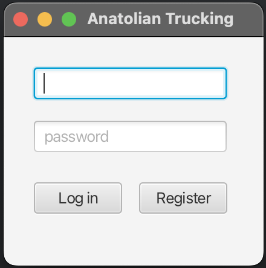
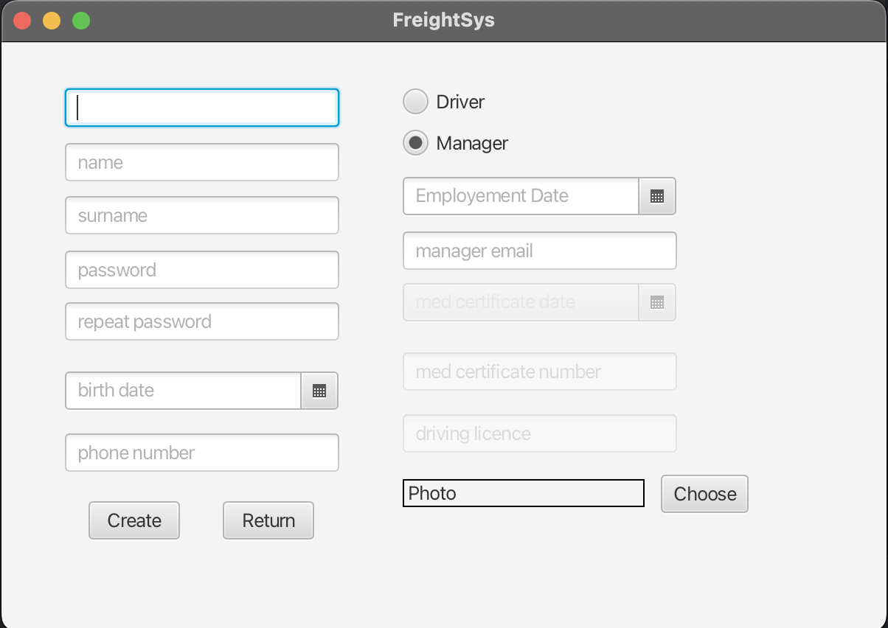
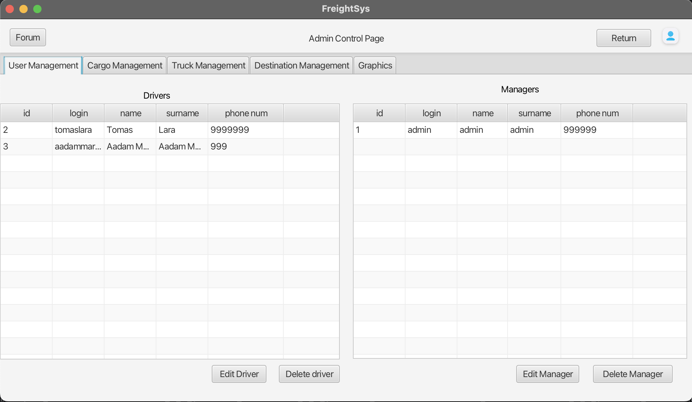
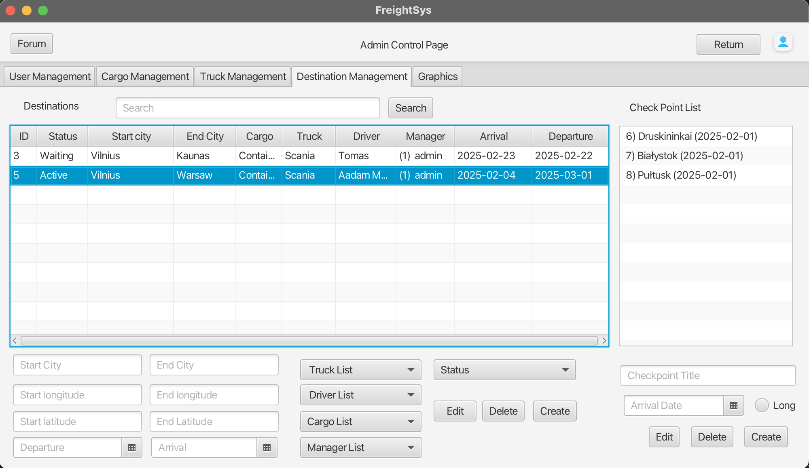
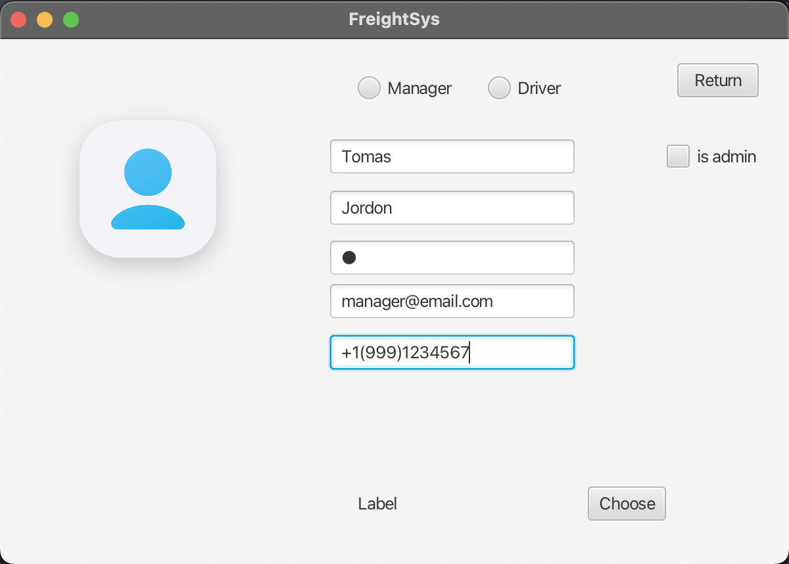
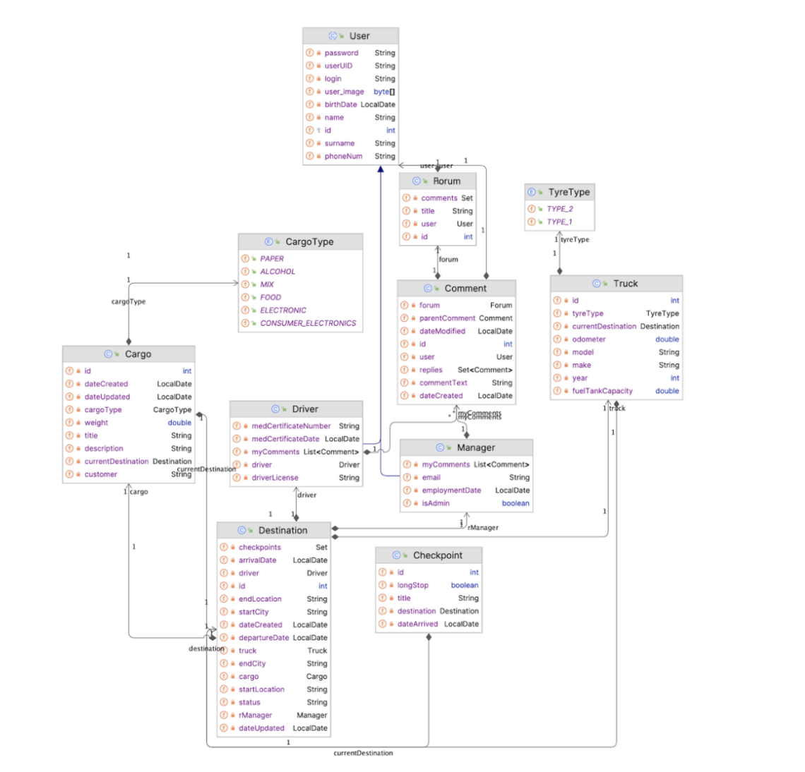
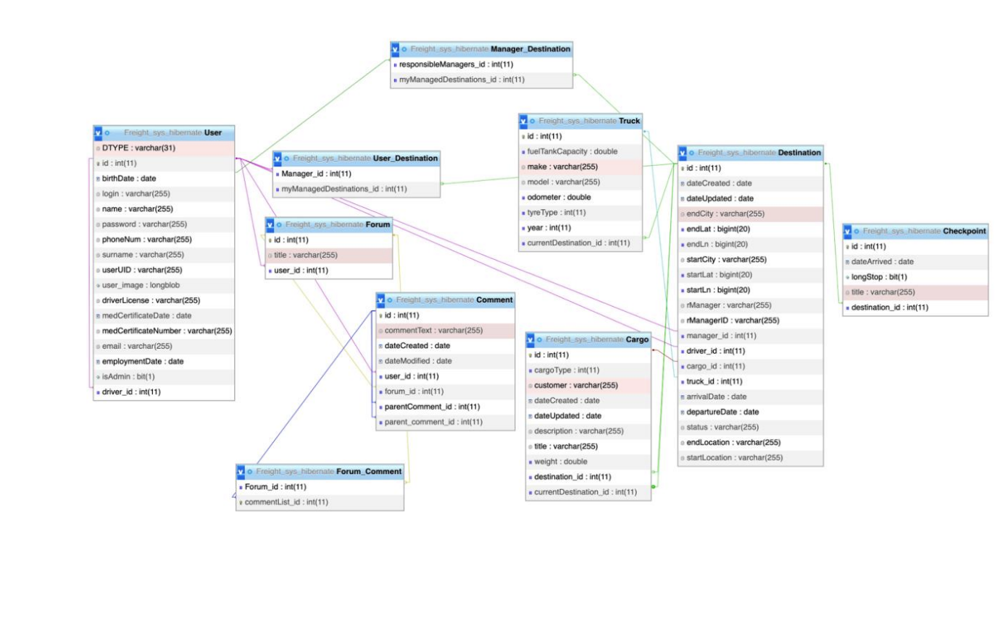
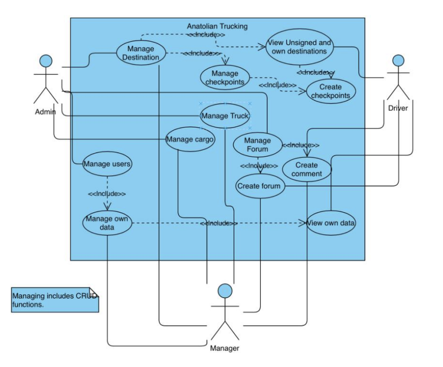

# Anatolian Trucking System

## Overview
A comprehensive Java-based desktop application for managing trucking company operations, including driver management, cargo tracking, and route planning.

## Features
### Core Functionality
- User management (Admin, Manager, Driver roles)
- Real-time cargo tracking
- Route planning and optimization
- Forum system for internal communication
- Checkpoint management
- Integrated mapping system

### Technical Stack
- JavaFX for desktop UI
- Hibernate ORM for database operations
- MySQL for primary database
- Firebase (experimental implementation)
- Google Maps API for routing

## Setup Requirements
### Prerequisites
- Java 8 or higher
- MySQL Server running on port 3306
- Maven for dependency management

### Database Configuration
The application currently uses a local MySQL database with these default settings:
URL: jdbc:mysql://localhost:3306/Freight_sys_hibernate3

Username: root

Password:

### Firebase Integration (Optional)
The application includes experimental Firebase integration (currently commented out). To enable:
1. Obtain Firebase API credentials
2. Configure `mydatabase-firebase-adminsdk.json` with your API key and other informations
3. Uncomment Firebase-related code in the project

### Google Maps Integration (Optional)
To enable route optimization:
1. Obtain Google Maps API key
2. Configure the API key in the application
3. Uncomment related mapping code

## Installation
1. Clone the repository: git clone https://github.com/yagcifuad/anatolian-trucking.git
2. Configure database settings in `persistence.xml`
3. Build the project using Maven
4. Run the application

## Project Structure
```bash
src/
├── FIREBASE/         # Firebase configuration files
├── fxControllers/  # Page and table configuration files
├── hibernateControllers/  # Database management
├── model/            # Data models
├── utils/            # Utility classes (to read/write data from/to file)
└── view/             # JavaFX view files 
```

## Contributing
1.Fork the repository and create a feature branch.
2.Follow code style guidelines (e.g., Java conventions).
3.Open a Pull Request (PR) for review.
4.For major changes, open an issue first to discuss your proposal.

## License
This project is licensed under the MIT License - see the [LICENSE](LICENSE) file for details.

## Screenshots
### Login Page


### Register Page


### Manager Main Page
  

### Manager Destination Page


### Manager Profile Page


### Data Structure
  

### Database Schema Diagram


### Use Case Diagram
  

